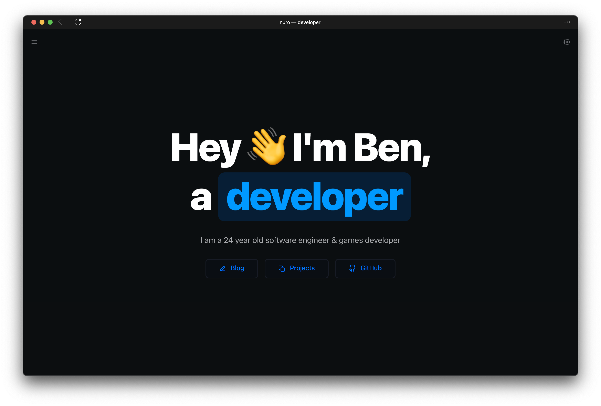

<div align="center">

<a target="_blank" href="https://nuro.dev">
    
</a>

[](https://nuro.dev)
[](https://github.com/tdemapp/website/blob/master/LICENSE)
[](https://vercel.com/import/project?template=https://github.com/nurodev/nuro.dev)
[](https://vercel.com/home?utm_source=nuro&utm_campaign=oss)

</div>

## Acknowledgement

This is a fork of [NuroDev's Personal Portfolio](https://github.com/NuroDev/nuro.dev) website template. It will be used as a template to create my own personal and professional blog space. Credit to the developer(s) who have contributed to this project thus far.

## 🛠 Development

Clone the repository

```zsh
git clone https://github.com/nurodev/nuro.dev.git
```

Install dependencies

```zsh
npm install

# Or using Yarn

yarn
```

Start the development server

```zsh
npm run dev

# Or using Yarn

yarn dev
```

Build for production

```zsh
npm run build

# Or using Yarn

yarn build
```

## 📄 License

MIT © [Ben Dixon](https://github.com/nurodev/nuro.dev/blob/main/LICENSE)
